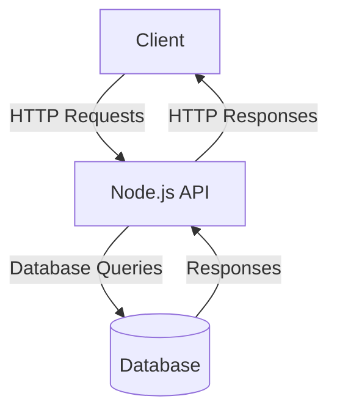
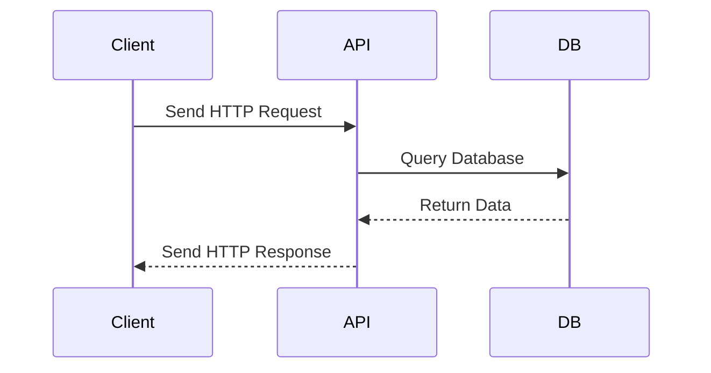

# Sample Node.js Application

This document provides an overview of a sample Node.js application, including its architecture and workflow. The application is designed to demonstrate a simple REST API with CRUD operations.

---

## Application Architecture

The following diagram illustrates the architecture of the Node.js application:



---

## Workflow

The workflow of the application is depicted in the sequence diagram below:



---

## Features

- **REST API**: Implements CRUD operations.
- **Database Integration**: Connects to a database for data persistence.
- **Error Handling**: Includes basic error handling for API requests.

---

## Getting Started

1. Clone the repository:
   ```bash
   git clone https://github.com/your-repo/sample-nodejs-app.git
   cd sample-nodejs-app
   ```

2. Install dependencies:
   ```bash
   npm install
   ```

3. Start the application:
   ```bash
   npm start
   ```

4. Access the API at `http://localhost:3000`.

---

## Reference Links

- [Node.js Documentation](https://nodejs.org/en/docs/)
- [Express.js Documentation](https://expressjs.com/)
- [Mermaid.js Documentation](https://mermaid-js.github.io/mermaid/#/)
